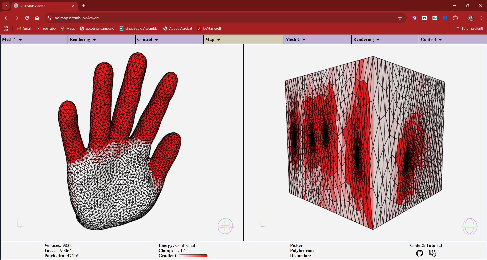

# VOLMAP Viewer



**VOLMAP Viewer** is a **web-based** tool for the visual assessment and analysis of **maps** between **tetrahedral meshes**.  
Users can load models directly in the browser and manage them with data structures optimized for interactive visualization.
You can display and interact in real-time with both source and target domains, check map validity, and compute map quality according to a variety of popular distortion metrics.

---
> ### **Table of Contents**
> 1. [Features](#features)
> 1. [Usage](#usage)
> 1. [Citing us](#citing-us)
> 1. [Acknowledgements](#acknowledgements)
---

## Features
[to update...]

## Usage
[to update...]

## Citing us
If you use VOLMAP Viewer in your academic projects, please consider citing the library using the following 
BibTeX entry:

```bibtex
@article{ [to update...] }
```

## Acknowledgements
This work was supported by [to update...]