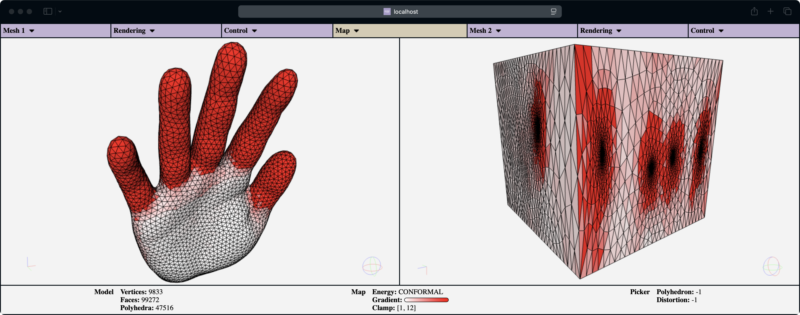

# VOLMAP Viewer



**VOLMAP Viewer** is a **web-based** tool for the visual assessment and analysis of **maps** between **tetrahedral meshes**.  
Users can load models directly in the browser and manage them with data structures optimized for interactive visualization.
You can display and interact in real-time with both source and target domains, check map validity, and compute map quality according to a variety of popular distortion metrics.

---
> ### **Table of Contents**
> 1. [Features](#features)
> 1. [Usage](#usage)
> 1. [Citing us](#citing-us)
> 1. [Acknowledgements](#acknowledgements)
---

## Features
[to update...]

## Usage

We've prepared a tutorial on how to use VOLMAP Viewer. You can find it at [this link](./tutorial.md)!

## Citing us
If you use VOLMAP Viewer in your academic projects, please consider citing the library using the following 
BibTeX entry:

```bibtex
@article{
  title = {VOLMAP Viewer: a Web-Based Interactive Visual Tool to Explore Volume Maps},
  author = {Giacalone, Alberto and Mulas, Dylan and Meloni, Federico and Cherchi, Gianmarco and Livesu, Marco},
  booktitle = {Smart Tools and Applications in Graphics},
  year = {2025},
  publisher = {The Eurographics Association},
  issn = {},
  doi = {}
}
```

## Acknowledgements
This work was supported by project “FIATLUCS - Favorire l’Inclusione e l’Accessibilità per i Trasferimenti Locali Urbani a Cagliari e Sobborghi” funded by the PNRR RAISE Liguria, Spoke 01, project “Tecnologie innovative e abilitanti per l’innovazione della pubblica amministrazione”, founded by PNRR, DM 118/2022, project “RAISE - Robotics and AI for Socio-economic Empowerment” (ECS00000035) funded by the European Union - NextGenerationEU and by the Ministry of University and Research (MUR), National Recovery and Resilience Plan (NRRP), Mission 4, Component 2, Investment 1.5, and INdAM (Istituto Nazionale di Alta Matematica “Francesco Severi”) for partially supporting his research.
